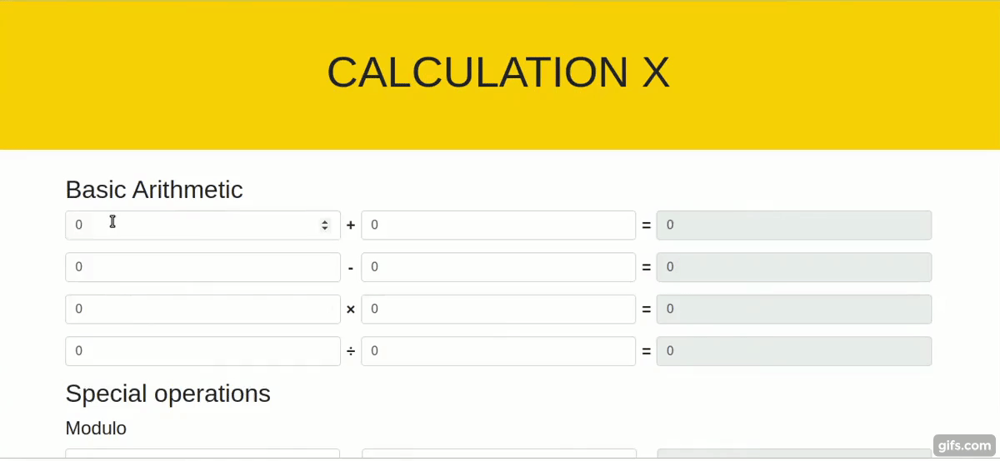

# Calculator

Description:

- The user will be able to input two numbers for which they would like to do two types of calculations: Basic Arithmatic and Special Operations.

- Basic arithmatic will involve addition, subtraction, multiplication and division.

- Special operations will deal with the calculation of modulo. 

- As soon as the users input the numbers, they will see an immediate result on the page as an outcome of the operation.

Instructions:

Create a Calculator app with the following operations:

1. Basic Arithmatic

- Addition
- Subtraction
- Multiplication
- Division

2. Special Operations

- Modulo

3. Create a function which calculates the result of two numbers depending on whether the inputs are being added, subtracted, multiplied or divided.

4. Required Calculations: addition, subtraction, multiplication, division and remainder of division.

5. Display the result of the calculation to the user immediately.

6. Include a header on the page.

7. Create a simple UI so that the user can input two numbers to perform a calculation.

Note: the calculations should only include two operands.

8. **Optional:** 
- Feel free to use Bootstrap for styling.

> Hint: Refer to the representation below, for an idea of what your result should look like.

